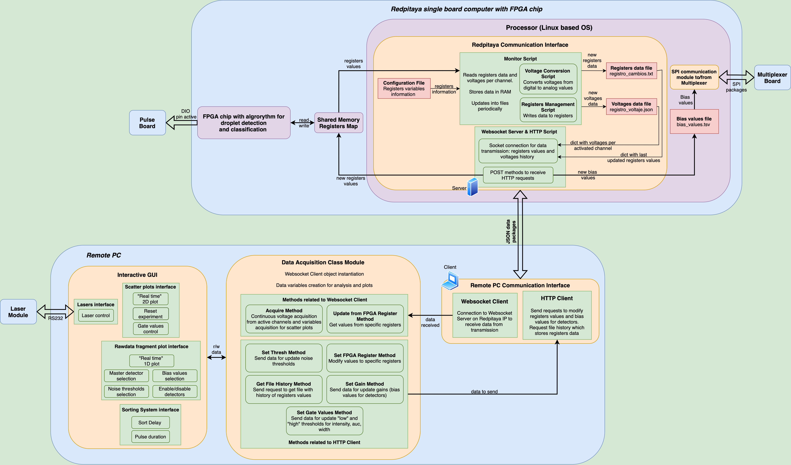

# Graphical User Interface and Communications Webserver of [RITMOS](https://github.com/wenzel-lab/droplet-sorter-master) [](https://github.com/ellerbrock/open-source-badges/)

See the [droplet sorter master repository](https://github.com/wenzel-lab/droplet-sorter-master) for more detail.
The Python + Bokeh based graphical user interfac (GUI), run on a desktop computer, communicates closely with the [RedPitaya computer brain of the droplet sorter, documented here](https://github.com/wenzel-lab/droplet-sorting-FPGA-controller), which contains the [communication architecture design for the GUI](https://github.com/wenzel-lab/droplet-sorting-FPGA-controller/wiki/GUI-Architecture). 
This repository holds the GUI code, the interaface mockups, and the development wishlist.

Follow us! [#twitter](https://twitter.com/WenzelLab), [#YouTube](https://www.youtube.com/@librehub), [#LinkedIn](https://www.linkedin.com/company/92802424), [#instagram](https://www.instagram.com/wenzellab/), [#Printables](https://www.printables.com/@WenzelLab), [#LIBREhub website](https://librehub.github.io), [#IIBM website](https://ingenieriabiologicaymedica.uc.cl/en/people/faculty/821-tobias-wenzel)

---

## Table of Contents
- [Introduction](#introduction)
- [Features](#features)
- [Interaction Between the User Interface and Red Pitaya](#interaction-between-the-user-interface-and-red-pitaya)
- [Installation](#installation)
- [Usage](#usage)
- [Dependencies](#dependencies)
- [Contribute](#contribute)
- [License](#license)
- [Contacts](#contacts)

---

## Introduction
Piccolo provides tools for droplet processing instruments. This project provides a user-friendly interface for sorting droplets and visualizing data from multiple detectors. It is built using Bokeh for interactive visualizations.

---

## Features
- Interactive data visualization of droplets in microfluidic fluorescence-activated droplet sorter
- Display and interact with data across different channels and set sorting gates in a UI
- Customizable settings for sorting and laser modules
- Support for multiple detectors and RS232 lasers

---

## Interaction Between the User Interface and Red Pitaya
This section describes how the graphical interface on the remote PC communicates with the Red Pitaya device to receive data from the FPGA and send configuration parameters.

The system enables bidirectional communication:

- Receiving data via WebSocket from Red Pitaya.
- Sending data via HTTP POST requests to configure FPGA registers and gain settings.



### Main Components

#### `ui_layout.py` – Graphical User Interface (GUI)
This script defines the structure and layout of the user interface using interactive widgets. It allows users to:

- Start/stop acquisition processes.
- Adjust threshold values and gain settings.
- Define and update classification gates (2D gates on AUC/Width/Intensity).
- Trigger configuration updates (e.g., `set_thresh()`, `set_gate_values()`).
- Display real-time plots of signals and droplet parameters.

Interaction:

- Calls methods in `DataAcquisition` class (from `data_acquisition.py`) in response to user actions.
- Automatically updates plots using the shared data updated from Red Pitaya.

The following indicates in which specific parts of ui_layout.py the methods of data_acquisition.py are called to update or modify certain variables and parameters. The name of the variable associated to the corresponding registers is also indicated (for details, see table presented in `Register Variables Description` section of the [`droplet-sorting-FPGA-controller`](https://github.com/wenzel-lab/droplet-sorting-FPGA-controller/tree/monitoring-logger) README document).

#### Voltage values for each detector channel - `adc_values` or `cur_adc_data`
Signal shown in 1D plot in Detector Settings section, calling the method `update_ui` of `UI` class. This method calls internally to `data` attribute of `DataAcquisition` class.

#### Correlation density values between channel parameters - not from FPGA registers but obtained from processing in `_acquire_signal` method
Points shown in 2D plot in Gating section, calling the method `update_ui` of `UI` class. This method calls internally to `data2d` attribute of `DataAcquisition` class.

#### Noise peak threshold for detectors - `min_intensity_thresh`
Noise signal sliders in Detector Settings section, calling the method `_noise_intensity_changed` of `UI` class. This method calls internally to `set_thresh` method of `DataAcquisition` class.

#### Lower peak intensity threshold for droplets - `low_intensity_thresh`
Box select in 2D plot in Gating section, calling the method `_boxselect_pass` of `UI` class. This method calls internally to `set_gate_values` method of `DataAcquisition` class.

#### Maximum peak intensity threshold for droplets - `high_intensity_thresh`
Box select in 2D plot in Gating section, calling the method `_boxselect_pass` of `UI` class. This method calls internally to `set_gate_values` method of `DataAcquisition` class.

#### Noise (width + hwfm) threshold for detectors - `min_width_thresh`
Noise boxes (to the right of noise signal sliders) in Detector Settings section, calling the method `_width_noise_input` of `UI` class. This method calls internally to `set_fpga_register_value` method of `DataAcquisition` class.

#### Lower peak width threshold for droplets - `low_width_thresh`
Box select in 2D plot in Gating section, calling the method `_boxselect_pass` of `UI` class. This method calls internally to `set_gate_values` method of `DataAcquisition` class.

#### Maximum peak width threshold for droplets - `high_width_thresh`
Box select in 2D plot in Gating section, calling the method `_boxselect_pass` of `UI` class. This method calls internally to `set_gate_values` method of `DataAcquisition` class.

#### Noise for area under the curve (auc) threshold for detectors - `min_area_thresh`
Noise boxes (to the right of noise signal sliders) in Detector Settings section, calling the method `_auc_noise_input` of `UI` class. This method calls internally to `set_fpga_register_value` method of `DataAcquisition` class.

#### Lower auc threshold for droplets - `low_area_thresh`
Box select in 2D plot in Gating section, calling the method `_boxselect_pass` of `UI` class. This method calls internally to `set_gate_values` method of `DataAcquisition` class.

#### Maximum auc threshold for droplets - `high_area_thresh`
Box select in 2D plot in Gating section, calling the method `_boxselect_pass` of `UI` class. This method calls internally to `set_gate_values` method of `DataAcquisition` class.

#### Reset experiment - `fads_reset`
Reset button in Gating section, calling the method `_reset_button_clicked` of `UI` class. This method calls internally to `set_fpga_register_value` method of `DataAcquisition` class.

#### Sort delay - `sort_delay`
Delay box in Sorting section, calling the method `_delay_pulse_input` of `UI` class. This method calls internally to `set_fpga_register_value` method of `DataAcquisition` class.

#### Sort duration - `sort_duration`
Pulse Duration box in Sorting section, calling the method `_duration_pulse_input` of `UI` class. This method calls internally to `set_fpga_register_value` method of `DataAcquisition` class.

#### Enable/Disable detectors - `enabled_channels`
Enable/Disable buttons in Detector Settings section, calling the method `_toggle_sensor` of `UI` class. This method calls internally to `set_fpga_register_value` method of `DataAcquisition` class.

#### Master detector - `droplet_sensing_addr`
Master detector selection in Detector Settings section, calling the method `_toggle_master_channel` of `UI` class. This method calls internally to `set_fpga_register_value` method of `DataAcquisition` class.

#### Peak intensity data of last completed droplet - `cur_droplet_intensity`
cur_droplet_intensity box in Gating section, calling the method `update_ui` of `UI` class. This method calls internally to `update_from_fpga_registers` method of `DataAcquisition` class.

#### Width (fwhm) data of last completed droplet - `cur_droplet_width`
cur_droplet_width box in Gating section, calling the method `update_ui` of `UI` class. This method calls internally to `update_from_fpga_registers` method of `DataAcquisition` class.

#### AUC data of last completed droplet - `cur_droplet_area`
cur_droplet_area box in Gating section, calling the method `update_ui` of `UI` class. This method calls internally to `update_from_fpga_registers` method of `DataAcquisition` class.

#### Multiplexer bias voltage for detectors - not saved in FPGA registers but in Redpitaya procesor
Detector Gain signal sliders in Detector Settings section, calling the method `_gain_changed` of `UI` class. This method calls internally to `set_gain` method of `DataAcquisition` class.


#### `data_acquisition.py` – Core Acquisition and Processing Layer
Acts as the central logic hub that manages both incoming data and outgoing configuration:

- Receives and parses data from `websocket_client.py` with `_acquire_signal()` method, including:
    - Channel voltages (`voltage_history`)
    - Feature values: intensity, width, area per droplet
- Processes data with `_acquire_signal()` method:
    - Stores values in dictionaries for each PMT channel (e.g., `pmt1`, `pmt2`...).
    - Calculates and updates 2D density plots via KDE.
- Updates data from key registers with `update_from_fpga_register()` method.
- Sends commands to Red Pitaya via `http_client.py`:
    - Sets thresholds, gates, signal duration, delay, gain.
    - For the above, uses the methods `set_thresh()`, `set_gain()`, `set_gate_values()` and `set_fpga_register_value()`.
- Links directly to the GUI: methods are called by `ui_layout.py`.

#### `websocket_client.py` – Data Receiver
Implements an asynchronous WebSocket client that connects to Red Pitaya’s server (`ws://<ip>:8000/ws`).

- Runs in a background thread.
- Receives continuous data updates in JSON format.
- Updates an internal attribute `self.data_received` with:
    - ADC values per channel
    - Current droplet ID, intensity, width, area
    - Droplet classification
    - Voltage history for active channels

This data is accessed periodically by the `data_acquisition.py` module to update plots and extract features.

**IMPORTANT: before execute the GUI software you have to change the Redpitaya IP address in variable `RP_IP` in `websocket_client.py` script.**

#### `http_client.py` – Configuration and Command Dispatcher
Handles HTTP requests to the Red Pitaya server (`http://<ip>:8000`):

- `set_fpga_register(data)`: Sets individual FPGA register values.
- `set_gain(data)`: Updates gain values for the Multiplexer Board.
- `get_file()`: Downloads a .txt file with logged register events and voltages.

Used internally by data_acquisition.py in response to GUI-triggered actions.

**IMPORTANT: before execute the GUI software you have to change the Redpitaya IP address in variable `RP_IP` in `http_client.py` script.**

### Summary of the Communication Flow
1. Real-time acquisition:
    WebSocket transmits data from Red Pitaya → `websocket_client.py` → `data_acquisition.py` → `ui_layout.py` → GUI updates.
2. Control commands:
    User interaction in GUI → `ui_layout.py` → `data_acquisition.py` → `http_client.py` → Red Pitaya updates FPGA registers/bias values
3. Download history:
    Triggered from the GUI → `ui_layout.py` → `data_acquisition.py` → `http_client.py` → Download .txt file via HTTP → Saved locally.

---

## Installation

> [!WARNING]
> Firstly, make sure you have conda installation and environment in your device:
```
conda info
conda create --name <your environment>
conda activate <your environment>
```

To install the necessary dependencies, make use of our .yml file and run:

` conda env update -n <your environment> --file bokeh_2.yml`

---

## Usage
> [!IMPORTANT] 
> Make sure all dependencies are installed, active and properly located.

Run: 

` bokeh serve --show ui_layout.py`

---

## Organization

1. #### LASER CONTROLS:
    

2. #### DROPLET VISUALIZATION:
    

3. #### SIGNAL VISUALIZATION:
    

4. #### SORTING CONTROLS:
    

---

## Dependencies

The main dependencies for this project are:

- `bokeh`
- `numpy`
- `pandas`
- `pyserial`
- `requests`
- `scipy`
- `tornado`
- `websockets`

These and additional dependencies can be found in `bokeh_2.yml`.

---

## Contribute

This is an open project in the Wenzel Lab in Santiago, Chile. If you have any suggestions to improve it or add any additional functions make a pull-request or [open an issue](https://github.com/wenzel-lab/droplet-sorter-master/issues/new).
For interactions in our team and with the community applies the [GOSH Code of Conduct](https://openhardware.science/gosh-2017/gosh-code-of-conduct/).


---

## License

Apache 2.0


---

#### Contacts

Joaquín Acosta - Pontificia Universidad Católica de Chile
Tobias Wenzel - Pontificia Universidad Católica de Chile
Kendra Nyberg - Calico Life Sciences LLC
